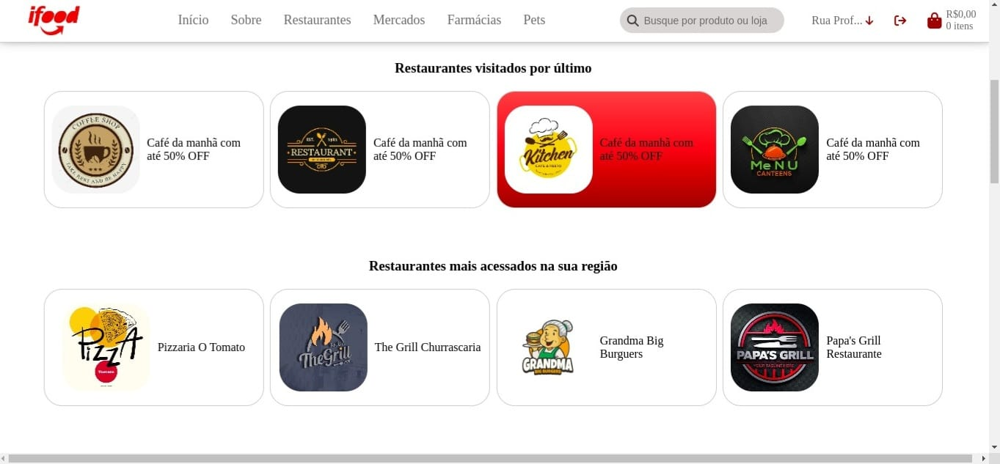
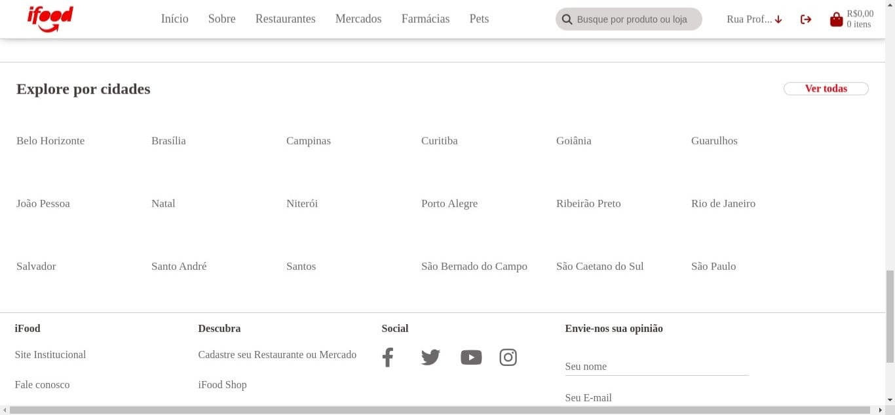

# Exercício 5 | Projeto #2: Vem Ser Tech - Front End | Ada Tech

## Sobre

O projeto se trata de um front end estático básico, utilizando apenas HTML5 e CSS vanilla. Esse projeto foi desenvolvido com intuito de realizar uma atividade de entrega do curso Front end, na Ada Tech. O objetivo do projeto foi desenvolver um site baseado no iFood, utilizando tags semânticas. Tendo como requisitos obrigatórios o uso da header, main, footer, figure, figurecaption, form e nav. Além disso, teve como objetivo adicional a responsividade do site para aparelho celular (versão mobile).

### Como executar o projeto em desenvolvimento

1. Clone esse repositório:
```
git@github.com:BrendaRSS/exercise-five-adatech-project-2-static-frontend-.git
```
2. Acesse a página pelo seu navegador.

### Imagens do projeto

<div>
    <h4>Versão Desktop</h4>
    <div style="gap:10px;">
        
        
        
        
        
        
        
        
    </div>
    <br/>
    <h4>Versão Mobile</h4>
    <div style="width:100vw;">
        
        
        
        
        
        
    </div>
</div>